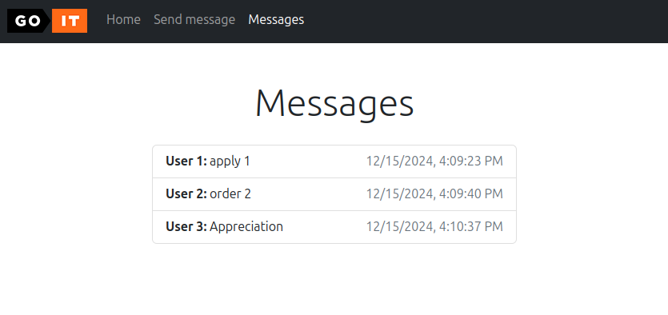

# goit-cs-hw-06
Тема 12. Socket Programming та комунікації реального часу

Перед початком роботи:
1. Версія **Python: >=3.12**
2. Cтворюємо віртуальне середовище (Python: >=3.12) `.env`: `python -m venv .env`
3. Активуємо (відповідно до своєї ОС): `source .env/bin/activate`
4. Інсталюємо залежності: `pip install -r requirements.txt`
5. По завершенню роботи деактивовуємо: `deactivate`
6. Переконатись що встановлено `Docker` та `Docker Compose`

## Технічний опис завдання
Вам необхідно реалізувати найпростіший вебдодаток, не використовуючи вебфреймворк.

### Інструкція та вимоги до виконання
За аналогією до розглянутого в конспекті прикладу, створіть вебдодаток з маршрутизацією для двох html-сторінок: `index.html` та `message.html`. За основу візьміть [наступні файли](./src/front-init).

**Також**:
- обробіть під час роботи програми статичні ресурси: `style.css`, `logo.png`;
- організуйте роботу з формою на сторінці `message.html`;
- у разі виникнення помилки `404 Not Found` повертайте сторінку `error.html`.
- ваш HTTP-сервер повинен працювати на порту `3000`.

Для роботи з формою створіть Socket-сервер на порту `5000`. Алгоритм роботи має бути такий:
- вводите дані у форму,
- вони потрапляють у вебдодаток, який пересилає його далі на обробку за допомогою `socket` (протокол `UDP` або `TCP` на ваш вибір) Socket-серверу,
- Socket-сервер переводить отриманий байт-рядок у словник і зберігає його в базу даних `MongoDb`.


Формат запису документа MongoDB має бути наступного вигляду:
```json
{  
	"date": "2022-10-29 20:20:58.020261",    
	"username": "krabaton",    
	"message": "First message"  
},  
{ 
	"date": "2022-10-29 20:21:11.812177",
  "username": "Krabat",    
	"message": "Second message"  
}
```

Ключ `"date"` кожного повідомлення — це час отримання повідомлення: `datetime.now()`. Тобто кожне нове повідомлення від вебпрограми має дописуватися до бази даних з часом отримання.

### Критерії прийняття
1. Використано для створення вебпрограми один файл `main.py`. Запущено HTTP-сервер і Socket-сервер у різних процесах.
2. Створено `Dockerfile` та запущено додаток як Docker-контейнер.
3. Написано docker-compose.yaml з конфігурацією для застосунку та `MongoDB`.
4. Використано `Docker Compose` для побудови середовища, команду `docker-compose` up для запуску середовища.
5. За допомогою механізму `voluemes` збережено дані з бази даних не всередині контейнера.
6. Оброблено статичні ресурси: `style.css`, `logo.png`.
7. У разі виникнення помилки `404 Not Found` повертається сторінка `error.html`.
8. Робота з формою організована згідно з наведеними вище вимогами.
9. Формат запису документа MongoDB відповідає вищезазначеним вимогам.

### Запуск та перевірка
Дані бази даних зберігаються в окремому іменованому контейнері (можна також зберегти в локальну папку `/storage` за потреби).
Папка `/src/logs` в контейнері з'єднана з локальною папкою `/logs` усі логи зберігаються сюди. В основному меню додано пункт "Messages" який відображає усі збережені повідомлення.
Запуск:
- `docker-compose build`
- `docker-compose up`
- Відкриваємо в браузері сторінку: "http://localhost:3000"
- `docker-compose stop` або `docker-compose down -v` (якщо потрібно видалити контейнери)



### Ресурси
- [./src/main.py](./src/main.py)
- [./src/front-init](./src/front-init)

## Додатково
- [Фінальне завдання](https://www.edu.goit.global/uk/learn/25315460/19336208/21189559/homework)
- [https://github.com/nickolas-z/goit-cs-hw-06](https://github.com/nickolas-z/goit-cs-hw-06)
- [goit-cs-hw-06-main.zip](https://s3.eu-north-1.amazonaws.com/lms.goit.files/ccee6780-ce80-4eef-a868-97824619d49f%D0%94%D0%976_%D0%97%D1%83%D0%B1%D1%87%D0%B8%D0%BA%D0%9C%D0%B8%D0%BA%D0%BE%D0%BB%D0%B0%D0%9C%D0%B8%D0%BA%D0%BE%D0%BB%D0%B0%D0%B9%D0%BE%D0%B2%D0%B8%D1%87.zip)
- [Computer-Systems-and-Their-Fundamentals](https://github.com/nickolas-z/Computer-Systems-and-Their-Fundamentals)